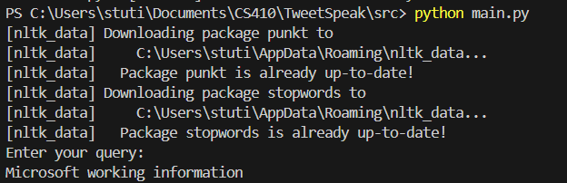
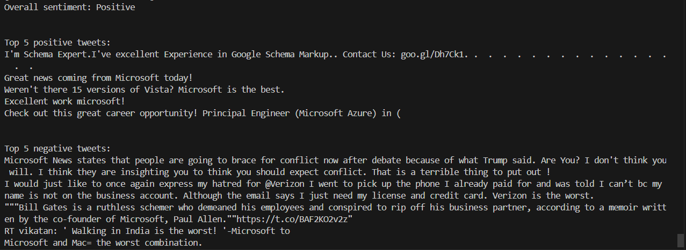

# TweetSpeak

This project implements a sentiment analysis tool for finding out the popular opinion on a given a topic.


## Summary

-> We are using a Twitter Sentiment Analysis Kaggle dataset to get an annotated twitter sentiment analysis dataset

-> We are preprocessing the dataset and created an inverted index on it, and getting an extensive vocabulary for it. We use Hadoop to get the inverted index

-> The user can input a search query when prompted, and using BM25 normalisation we find the most relevant tweets to the query and then run IBM watson sentiment analysis and Hugging face transformets library on it to get the overall sentiment and the top 5 positive and negative tweets about the query

## Steps to run 
 
 Suggested: create a python venv with Python 3.10.7 
 ```
 py -3.10.7 -m venv myenv

On Windows:

myenv\Scripts\activate

On macOS and Linux:

source myenv/bin/activate
```

Install requirements:
 ```
 pip install -r requirements.txt
 
```

 For a demo of the working pipeline, from the root directory run

```
cd src
python main.py # for transformers results
python main-ibm.py # for IBM Watson results

```

You should see where you can enter the query:


After you enter the query this is the response:



